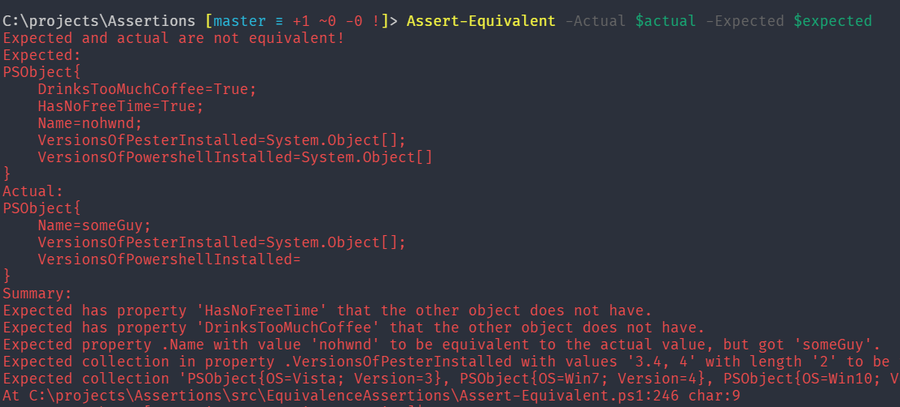

# Pester assertions

> Prototyping a suite of more advanced and more consistent assertions for Pester.

The general way in which the assertions should be used is the pipeline form.

```powershell
1 | Assert-Equal 20
```

Each assertion provided Message parameter to specify custom failure message, where
`{0}` and {1}, `<expected>` `<actual>` or `<a>` `<e>` can be used to expand the passed values.

Assertions are split into categories based on type. To provide a common language and ease of use, there is a layer of general assertions that
may delegate work to specialized assertions.

```powershell
'abc' | Assert-Equal 'bde' -> Assert-StringEqual 'abc' 'bde'
'abc' | Assert-Equal -Exactly 'bde' -> Assert-StringEqual 'abc' 'bde' -CaseSensitive
```

The type specific assertions are also exposed from the module to offer type specific options:

```powershell
Assert-StringEqual 'Abc' 'Ab c  ' -CaseSensitive -IgnoreWhitespace
```

There is a special type of assertions that allow to compare values, objects and collections as a whole, and print a readable report in the assertion message. Those assertions are a convenient way to write more robust tests suites, as they provide better alternative to using multiple assertions in one test.




? Should the Expected or Actual go first to enable specifying without parameters and avoid future problems?
? how to handle pipeline input to allow working with collections, and single values intuitively?

 where each assertion should have an option to specify a custom exception message

 ??? Enable pipelining of the assertions by outputting the input value (or some product like exception) from every assertion?

 ```powershell
 #this is stupid example, I am returning the values, but I need better use cases where it is actually useful
 #maybe with Assert-ObjectEqual and property selection, and definitely with Assert-Throw
"hello my name is..." |
    Assert-StringStartWith "hello" |
    Assert-StringEndWith "..."
 ```

? define OFS (field separator) in the scope of the assertion to ', ' to be able to write @(1,2,3) | Assert-StringEqual "1, 2, 3"

? add property param to Assert-Equal to be able to do:

```powershell
$actual = [PsCustomObject]@{ Name="Jakub"; Age=28 }

$actual |
    Assert-ObjectEqual -Property Name -Expected 'Jakub' |
    Assert-ObjectEqual -Property Age -Expected 28

#even though with equivalence assertion you will be able to simply do
$expected = [PsCustomObject]@{ Name="Jakub"; Age=28 }
$actual = [PsCustomObject]@{ Name="Jakub"; Age=28; DrinksTooMuchCoffee = $true }

$actual | Assert-Equivalent -Property Name, Age -Expected $Expected
```

? maybe this can be made even more useful by providing a scriptblock for the `Assert-*`

```powershell
    $object | 
        Assert-Equal { $actual.Name } -Expected "jakub" |
        Assert-Equal { $actual.Age } -Expected "28" |
        Assert-True  { $actual.DrinksTooMuchCoffee }
```


? consider restricting expected value to be mandatory for assert-equal, to assert null use assert-null, helped me detect errors easily when I provide no $Expected value, or $Expected is coming from TestCases and I forget to provide the param, but it limits how you can mix values in testcases (imho small price to pay)


### Object equivalence

? is this true: For values equivalence and equality is the same -- not exactly, the equivalence is broader


I need to be able to compare two values.
compare array with a single value to a value
compare value to a single item array
compare two arrays when each of them have more then one value
compare object to value by comparing object to value.
compare object to object by comparing each value and that there are all of them.
compare special object type to special object type

? special treatment for hashtables?
? special treatment for dictionaries?
? special treatment for scriptblocks?

? formatting objects the values, is it a good idea to include the type name? and in which format? for hashtable `@{}` is fine, but for psobject it is better to use `PSObject{}` than some custom cryptic thing like `#{}`
? is it valid and *useful* to compare scriptblocks as strings? (they can come from different files and so on)
! more important it is to write useful info to the screen.


- The expected side determines the type to be compared.
- single items in array are considered single values.
- value types are compared by value
- reference types equal if all of their properties are equal.

making a table of types and their significant properties I should not rely on the type being loaded, instead use string of the full type name and then check if the type can be constructed using try catch (is there a more efficient way?)
`[type]"nonexisting" `
if I can construct the type then I will do -is check on it to be able to reuse rules for inherited types (order rules from most specific). The incoming instance must be an instance of a type that is loaded so the -is check is enough.


I need to check if a given comparator should be used (for example when value on the left side is bool and on the right side is string that is equivalent to a boolean) I will use `Use-*Comparator` function for that. Then optionally adapt the values in a `Update-*` function and carry out the test on the real (possibly adapted) values using a `Test-*` function. Then retrieve a message using a `Get-*Message` function, and pack it in a result object that will have the incoming values, adapted values, and result message. This all will happen in a `Compare-*` function.


- we got multiple categories of input, namely: 
    - $null
    - values
    - hashtables
    - dictionaries
    - collections
    - objects

In the main comparison function we need to check which of the categories of objects is on the expected side to determine which comparator to use. Each of the comparators then need to check the actual side and act accordingly.


### General
Assert-Equal ✓
Assert-NotEqual ✓

Assert-Same ✓
Assert-NotSame ✓

Assert-Type ✓
Assert-NotType ✓

Assert-Null ✓
Assert-NotNull ✓

# comparables
Assert-GreaterThan ✓ (alias: Assert-NotLessThanOrEqual)
Assert-GreaterThanOrEqual ✓ (alias: Assert-NotLessThan)

Assert-LessThan ✓ (alias: Assert-NotGreaterThanOrEqual)
Assert-LessThanOrEqual ✓ (alias: Assert-NotGreaterThan)

Assert-InRange
Assert-NotInRange

### Booleans
Assert-True
Assert-False

### Strings

(all should get -CaseSensitive switch, and Ignore Whitespace switch)
Assert-StringEqual ✓
Assert-StringNotEqual ✓

Assert-StringNullOrEmpty
Assert-StringNotNullOrEmpty

Assert-StringNullOrWhiteSpace
Assert-StringNotNullOrWhiteSpace

Assert-StringLike
Assert-StringNotLike

Assert-StringMatch
Assert-StringNotMatch

Assert-StringStartWith
Assert-StringNotStartWith

Assert-StringEndWith
Assert-StringNotEndWith

Assert-StringLength

### Numbers
 
Assert-NumberEqual (Will get tolerance.)
Assert-NumberNotEqual

Assert-NumberGreaterThan (alias: Assert-NumberNotLessThanOrEqual)
Assert-NumberGreaterThanOrEqual (alias: Assert-NumberNotLessThan)

Assert-NumberLessThan (alias: Assert-NumberNotGreaterThanOrEqual)
Assert-NumberLessThanOrEqual (alias: Assert-NumberNotGreaterThan)


Assert-NumberInRange
Assert-NumberNotInRange

? Assert-Positive
? Assert-Negative

### ? Date Time & Time spans
not priority


### Collections
Assert-CollectionNotEmpty
Assert-CollectionLength 

Assert-CollectionContain ✓ (expected is subset of actual)
Assert-CollectionNotContain ✓

Assert-CollectionEqual (same items with the same order, exists in general)
Assert-CollectionEquivalent (same by value items, different order, exists in general, how about repetitions?)

? Assert-CollectionInstersect

? start with
? end with

? all
? any

### Hashtables ?

equal, equivalence? count? 

### Exceptions

should return the actual exception to the calling code, by default matches any exception of that family!
? how to handle non-terminating errors? switch to force them to fail? also needs some improvement on Pester side

Assert-Throw -ExceptionMessage -ExceptionType -FullyQualifiedErrorId -Exactly
Do not add assert-notthrow!

### Execution time assertions 
? Assert-NotExceed (name?)

